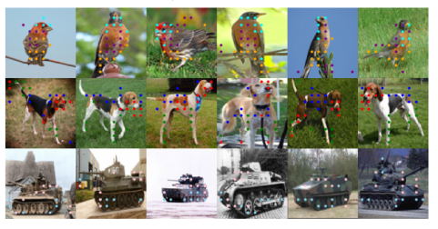
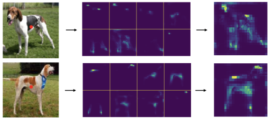
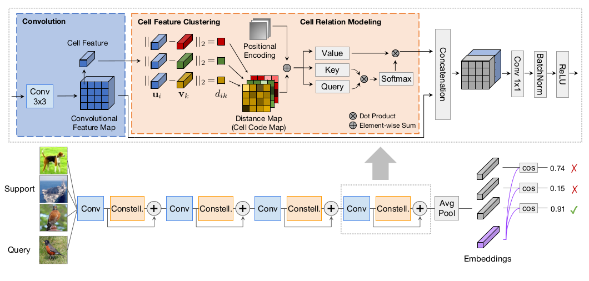
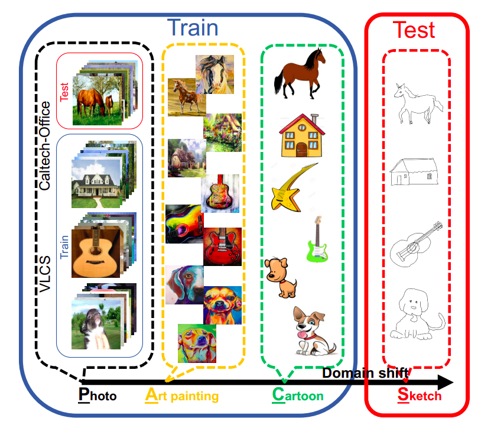

## Attentional Constellation Nets For Few-shot Learning

In this blog post we will address and evaluate a novel approach to few-shot learning. This approach has been presented in the article Attentional Constellation Nets For Few-shot Learning [1] by Weijian Xu, Yifan Xu, Huaijin Wang, and Zhuowen Tu, published in 2021. Throughout this post we will first introduce few-shot learning. Then we will present the contribution to the field the previously stated paper provided. Finally we will evaluate the models presented in the paper and apply them to a different problem than few-shot learning, namely domain generalization.

### Few-Shot Learning

Few-Shot Learning, as the name implies, indicates a problem where an algorithm needs to make inferences on new data (as in classifying new images), but there is little available labeled data. A typical Neural Network needs to set numerous parameters, and therefore can be trained optimally only when many data samples are available for training.

The way Few-Shot learning is, therefore, approached is as a meta-learning problem. Meta-learning is used to indicate the process of learning how to learn. Indeed, the intuition behind Few-Shot learning is that instead of learning to which class an image might belong to, a task that requires many training instances for each available class, we can learn how to distinguish images belonging to different classes. 

Imagine, for example, that you are presented with three distinct photos: a penguin, a lion and a dog. If now you get a new picture which contains one of the latter animals, how would you find out which animal it actually is? Probably by comparison! Here we mean that without knowing what penguins, lions and dogs look in general, you can classify the new image by simply comparing it to each one of the images you were previously given and simply choosing the animal which looks more similar to the new one!

This example might seem a trivial task for a human, but it isn’t for a machine! Indeed which features would a machine need to compare in order to make a correct guess? For example the presence of a beak would indicate unequivocally (or so we hope), that the new image contains a penguin. The machine needs therefore to learn how to create a feature embedding that can then apply to the little data available in order to distinguish different classes, without learning the classes directly. Therefore learn how to learn the new classes. Hence the meta-learning definition of the problem.

The authors of the paper focus on a particular field of few-shot learning: metric-based approaches. The latter indicates the method of learning a fixed feature embedding whose instances can be compared (in order to make correct prediction) using a distance function. 

In order to understand in more detail the learning process of a metric based few-shot model, maybe surprisingly, we will start by how the model is evaluated. First from our available testing data we sample a subset which we will refer to as the support set. The support set contains a number k of classes and a number n of instances per class. Throughout this post we will evaluate different models using either 1 or 5 instances per class. We can now take an undefined number of images which must not belong to the support set. We will refer to these images as the query set. To evaluate the model we use it to generate the features embedding of the support and the query set. Now we can use the distances between an item of the query set and all the items of the support set to make our prediction. We can finally evaluate the model by comparing our prediction to the true class values of the query set. 

What we need to address now is, instead, how to train the model generating the feature embeddings? 

To do so we use a training dataset which must contain only classes and instances not present in the testing dataset (so that we can really evaluate how the model performs against new classes). We then can sample from the training dataset an episode, which is simply composed by a support and a respective query set. We make a forward pass to compute our predictions as stated previously and we then use the loss against the true class value to update the weights of the model.

### Authors’ contribution
When typically training a deep convolutional neural network the weights of the different filters are left to the machine to fill out, through a learning process. These filters, or kernels, will then encode several features of a general image. We refer to these features as implicit, since they are learned implicitly by the model. 

Implicit features are usually enough to correctly classify different samples given the model was trained on an extensive dataset. This is, however, not true anymore in few-shot learning. The authors, therefore, implement different ways to specify explicitly features that must be learned. The way these approaches are implemented and the way they are stacked together constitutes the main contribution the authors of the paper give to the field. 

These approaches are clustering and self-attention.

#### Feature Clustering
The first step the author proposes is to add feature clustering. By the latter we mean that, once a feature map is computed by a convolution layer, its cells (vectors of all channels for a specific position of the feature map) are divided into different clusters using k-means. Each cell is therefore assigned, in an approximative manner, to one of the centroids, meaning that for each feature cell we calculate the probability for it to belong to any of the centroids. The total number of centroids is a hyperparameter of the model. 

*Figure 2: From [1] Each color represents a cluster, and each point, marked as "·", represents a cell assigned to a cluster center.*

By computing the distance from each feature cell to each centroid, we can finally have a distance map, effectively obtaining a spatial distribution of the different clusters (which correspond to images’ parts or features). 

#### Feature Relation and Spatial Configuration 
The authors, after computing the distance map, use a self-attention mechanism to build a spatial relationship between the different parts (distinguished features of an image) identified in the previous steps through clustering. 

Effectively, using clustering and self-attention, the model is then able to compute explicit features encoding structural features (clustering) and their relation within the image space (self-attention). These features yield new information which is able to strengthen the convolutional features (the features computed implicitly by the model). 

*Figure 3: From [1] We visualize attention maps of one query feature (at the location of red point
in left part) with all key features. The middle part shows the attention maps corresponding to 8 heads in the
multi-head attention. The right part shows an overlapped map of all attention maps.*

### Reproducing the Results of the Paper
For the reproduction of the results, it is chosen to use the existing code to reproduce the results in the paper. There are different network backbones available: Conv-4 and ResNet-12. We will focus on reproduction with the Conv-4 backbone, which is a network with 4 convolutional blocks. Each block has a 3×3 convolutional layer, a batch normalization layer, a ReLU activation and a 2×2 max-pooling layer. The model architecture can be seen in Figure 4.

*Figure 4: From [1] the bottom part is the network architecture
based on Conv-4 backbone, and the top part shows the constellation model.* 

We focused on two datasets the authors used to evaluate their model: CIFAR-FS and mini-ImageNet. The former is a few-shot classification benchmark containing 100 classes from CIFAR-100. The classes are randomly split into 64, 16 and 20 classes for training, validation and testing respectively. Each class contains 600 images of size 32 × 32.
mini-ImageNet contains 100 classes from ILSVRC-2012. The split between training and testing mirrors the one used for CIFAR-FS, but the size of the images is, instead, 84 × 84.

We used the same configuration used by the authors to set the hyperparameters of the model. We present the results on Table 1.

| **Results Backbone: Conv4**  |   | **CIFAR-FS**                 ||   | **mini-ImageNet**                  |
|------------------------------|---|------------------------------||---|------------------------------------|
| **Model**                    |   | **1-shot**     | **5-shot**   |   | **1-shot**          | **5-shot**   |
| **ConstellationNet (paper)** |   | 69.3 ± 0.3     | 82.7 ± 0.2   |   | 58.82 ± 0.23        | 75.00 ± 0.18 |
| **ConstellationNet (ours)**  |   | 69.03 ± 0.35   | 83.03 ± 0.33 |   | 58.85 ± 0.28        | 74.91 ± 0.22 |

The results obtained by us match with the ones presented by the authors within the confidence interval.

### ConstellationNet for Domain Generalization 
After reproducing the results presented in the paper we decided to train the model on a different dataset. However, we used a dataset which wasn’t built specifically for few-shot learning, instead we used PACS [2] (Photos, Art paintings, Cartoons and Sketches), which is a dataset built for evaluating a model against the task of domain generalization. 

By domain generalization we refer to the problem of training a model with classes coming from a set of domains (e.g. Art paintings, Cartoons and Sketches) and evaluate how the model performs with samples belonging to the same classes it was trained on but coming from a different domain (e.g. Photos).

We noticed, indeed, that we could draw a parallel between few-shot learning and domain generalization. In the former we want to learn how to extract features in order to generalize classification to new classes, while in the latter we want to learn how to extract features in order to generalize classification to new domains. 

Because of the resemblance of the problems, we decided to then use the model proposed by the authors for few-shot learning problems for a domain generalization problem, and evaluate how well it would perform in such a setting. 

#### PACS 
PACS stands for Photo, Art Painting, Cartoon and Sketch. It contains four different domains, identified within the name of the dataset. Each domain contains seven classes. Photo has 1670 images, Art Painting has 2048 images, Cartoon has 2344 images and Sketch has 3929 images. Each image has a size of 224 × 224. 

*Figure 5: From [2] the different domains for PACS.*

Since we wanted to use the same pipeline the authors implemented to train and test the model for CIFAR-FS and mini-ImageNet, we had to prepare the dataset. For that purpose we implemented a Python script which, given the root directory of where the PACS dataset is located, converts each image in a numpy array and pickles the dictionaries containing the training and test data before saving it. 

The script creates four different datasets for training and testing. In each one of them a different domain has been left out for testing. We split the images from the training domains 9 (train) : 1 (validation) and tested the model against the whole held-out domain. 

We then added a configuration file and python module (responsible for transforming the dataset into a processable input for the model) for each dataset within the files for ConstellationNet. 

We trained the model on a Google Cloud Virtual Machine with one GPU. Due to the limitations of the virtual machine GPU memory we could not process the images in their original size, but had to resize them. 

We tried to produce the results of the authors responsible for creating PACS, obtained when they trained on Art Painting, Sketch and Cartoon and tested on Photo (which was an accuracy of 89.50).

#### Results
The PHOTO dataset is trained and evaluated in two different ways. In the first one, the image size is 32 × 32 pixels and the number of clusters is 64. This gave an accuracy of 31.80 ± 0.25 for 1-shot and an accuracy of 40.39 ± 0.24 for 5-shot, training on 60 epochs. We tried to improve the accuracy by increasing the image size to 94 × 94 and by reducing the number of clusters to 32. This gives much better results, even though the training consisted of only 20 epochs (a limitation given by the limited memory we had on the virtual machine). The accuracy for 1-shot increased from 31.80 ± 0.25 to 54.59 ± 0.64 and the accuracy for 5-shot increased from 40.39 ± 0.24 to 70.05 ± 0.23. 

| **Results Backbone: Conv4**  |   | **PHOTO (from PACS)**                  |
|------------------------------|---|----------------------------------------|
| **Model**                    |   | 1-shot                  | 5-shot       |
| **Photo 32 × 32**            |   | 31.80 ± 0.25            | 40.39 ± 0.24 |
| **Photo 94 × 94**            |   | 54.59 ± 0.64            | 70.05 ± 0.23 |

We can see that we did not manage to reach the accuracy obtained by the authors of PACS (which was 89.50). However since we only used less than half of the original image size, we expect, given higher resources, that ConstellationNet will be able to produce close to state of the art performance for PACS.

### Discussion
Using ConstellationNet and few-shot learning also has its downsides. We found out that using this method, training is still a very important part. If there is too little training, the accuracy will significantly be lower. This might be counterintuitive since given the smaller datasets one might expect the model to converge to an optimal local minima at a faster rate.  

We also had some technical problems. Using Google Cloud, we only have a limited amount of credits to run a virtual machine. If you run out of credits, the billing account will shut down. This happened to us in the middle of training data, which caused some difficulties with obtaining the results. 

It is also important to set the parameters of the virtual machine at a reasonable value, paying special attention to memory or number of GPUs for example. 

However, given the fact that we managed to reproduce the results of the original paper we might conclude that ConstellationNet is a valuable model for few-shot learning and, more importantly, indicates a good direction future research might want to approach the problem. 

Furthermore we got promising results, given the hardware limitations, when we tried to use the model for domain generalization indicating that further research might want to build on this to further explore the parallels between models used for few-shot learning and domain generalization. 

### Contributions
Dajt Mullaj - 5649455: Set up the Google Cloud Virtual Machine for reproduction of the results. Run the model to reproduce the results. Prepared the PACS dataset by creating the script, configuration and inserting it into the code pipeline. Made the poster. Worked on the blog post. 

Kirsten Bos - 4589793: Searching for the differences in the code (py and ymal files) of the different dataset, researching the structure of the pickle file, testing/validating the improved photo (image size of 94) and worked on the blog post.

Marco de Böck - 4494237: Research on PACS, Training and Validation of the dataset PHOTO of [3,32,32] and worked on the blog post.

### References
[1] Xu, W., Wang, H., & Tu, Z. (2020, September). Attentional constellation nets for few-shot learning. In International Conference on Learning Representations.

[2] Li, D., Yang, Y., Song, Y. Z., & Hospedales, T. M. (2017). Deeper, Broader and Artier Domain Generalization. 2017 IEEE International Conference on Computer Vision (ICCV). https://doi.org/10.1109/iccv.2017.591
